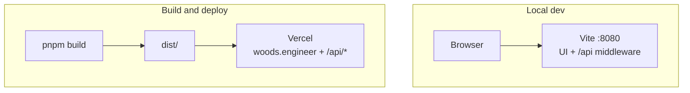
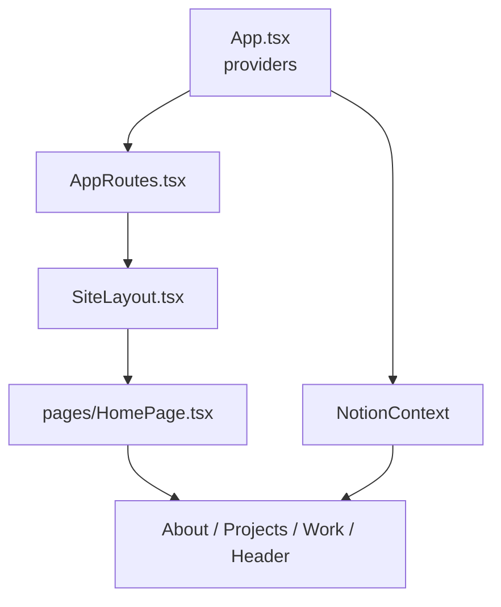
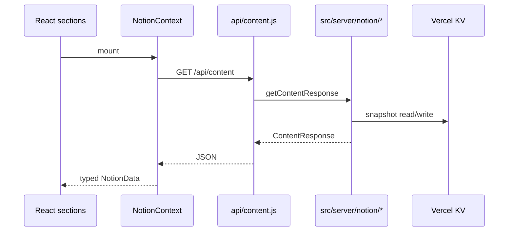
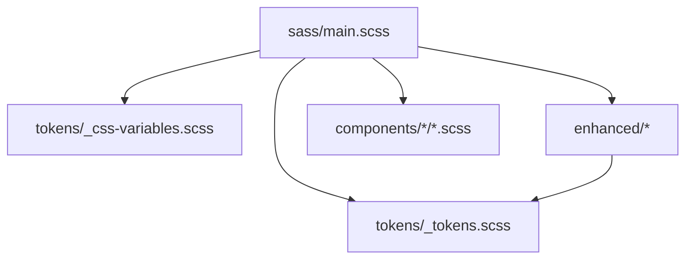

# Architecture

One-page map of how this repo is organized. Command details live in [AGENTS.md](../AGENTS.md).

## Runtime overview

| Mode | Command | Output / URL |
| ---- | ------- | ------------ |
| Dev | `pnpm start` | `http://localhost:8080` |
| Production build | `pnpm run build` | `dist/` |
| CI / Lighthouse | `pnpm run build:dev` | `dist/` (dev mode flags) |
| Deploy | Vercel (git push or CLI) | `https://woods.engineer` |

Build metadata (`REACT_APP_GIT_COMMIT_HASH`, `REACT_APP_BUILD_DATE`, `REACT_APP_VERSION`) is injected in [vite.config.ts](../vite.config.ts) via [scripts/build-metadata.js](../scripts/build-metadata.js).

## Application layers

| Path | Role |
| ---- | ---- |
| [src/App.tsx](../src/App.tsx) | Providers, loading gate, Matrix modal shell |
| [src/AppRoutes.tsx](../src/AppRoutes.tsx) | React Router table, Matrix URL sync |
| [src/components/Core/SiteLayout.tsx](../src/components/Core/SiteLayout.tsx) | Nav, vignettes, scroll chrome |
| [src/hooks/useMatrixActivation.ts](../src/hooks/useMatrixActivation.ts) | Matrix easter-egg state |
| [src/contexts/NotionContext.tsx](../src/contexts/NotionContext.tsx) | Content fetch + degraded mode |
| [src/hooks/useNotionSectionData.ts](../src/hooks/useNotionSectionData.ts) | Per-section loading helper |

Imports prefer the `@/` alias ([vite.config.ts](../vite.config.ts), Jest `moduleNameMapper`).

## Notion content flow

See [NOTION_INTEGRATION.md](NOTION_INTEGRATION.md) for schemas and env vars.

Retired: `GET /api/notion` (410), `scripts/server.js` (`:3001` legacy proxy).

## Sass layers

- **Core tokens** — theme maps and layout foundations
- **Bridge** — runtime CSS custom properties (`:root`, `.dark-theme`)
- **Enhanced** — navigation, micro-interactions, accessibility partials
- **Component SCSS** — co-located with React sections and effects

ADRs: [0001 enhanced CSS bridge](adr/0001-enhanced-css-variables-in-token-bridge.md), [0002 core vs enhanced tokens](adr/0002-core-vs-enhanced-sass-tokens.md), [0003 styled-components exception](adr/0003-loading-styled-components-exception.md).

## Related docs

- [MATRIX_COMPONENT.md](MATRIX_COMPONENT.md) — Matrix easter egg
- [DEVELOPMENT_NOTES.md](DEVELOPMENT_NOTES.md) — optional refactors
- [CODE_AUDIT_REPORT.md](CODE_AUDIT_REPORT.md) — historical audit stub
